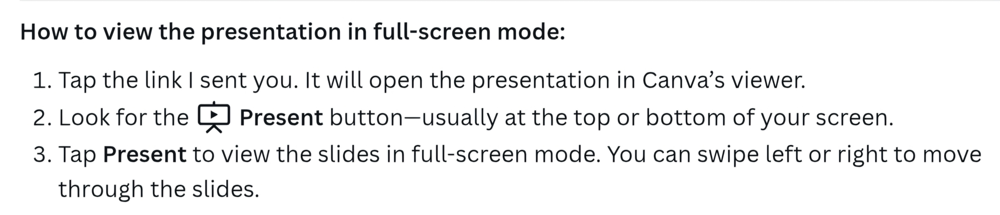

# Cerebral Vision: Healthcare Data & AI Strategy
## Facilitating Cerebral's Integration of Resilience Lab and the Center of Excellence Vision

<iframe src="https://raw.githack.com/rayserrano2735/Cerebral_Vision/main/docs/money_shot_interactive.html" width="100%" height="720" frameborder="0" style="border-radius: 10px; box-shadow: 0 4px 6px rgba(0,0,0,0.1);"></iframe>

> **THE NORTH STAR VISUALIZATION**  
> This is the board-ready insight AscendAI will deliver: Statistical proof that Cerebral outcomes converge toward Resilience Lab's proven baseline as methodology adoption increases across the combined organization. The platform transforms incompatible source systems into this single, actionable answer that validates merger ROI. Every architectural decision, every integration pattern, and every implementation phase drives toward enabling this visualization with real production data.

---

## Overview

This repository contains strategic vision and compliance documentation for implementing a modern, HIPAA-compliant data and AI platform for mental healthcare delivery. The approach combines proven enterprise data architecture patterns with cutting-edge AI capabilities to address the unique challenges facing mental healthcare organizations in 2025.

Mental healthcare organizations today face unprecedented challenges: DOJ monitoring for clinical decision integrity, FTC oversight for privacy protection, post-merger system integration across incompatible platforms, and the imperative to demonstrate measurable outcomes to payers and regulators. Traditional approaches to data management cannot meet these demands. Legacy systems scatter critical information across disconnected platforms, manual compliance processes create risk and operational burden, and inconsistent clinical workflows prevent evidence-based care at scale.

The AscendAI platform addresses these challenges through intelligent data architecture that unifies disparate sources, automates compliance monitoring, and enables real-time visibility into clinical and business operations. By implementing Universal Data Model patterns proven across healthcare enterprises, the platform transforms post-merger integration from a multi-year technical project into a strategic capability that delivers immediate business value. The result is not just regulatory compliance and operational efficiency—it's the ability to demonstrate clinical effectiveness, optimize care delivery, and make data-driven decisions that drive organizational success.

### About AscendAI

**AscendAI** represents a **product management approach** to the platform vision - not a pre-existing vendor product, but a complete solution framework with market-ready positioning.

**Why Brand the Platform?**

- **Product Thinking vs. Project Thinking**: Instead of "implementing a data warehouse," this positions a cohesive **product suite** that executives can champion and stakeholders can rally behind
- **Internal Marketing**: Gives the board and leadership something concrete to discuss, approve, and measure against ("How is AscendAI rollout progressing?")
- **Stakeholder Communication**: Simplifies complex architecture into a clear value proposition - "AscendAI provides clinical decision integrity and compliance automation"
- **Professional Positioning**: Demonstrates capability to think beyond technical implementation and create market-ready product concepts
- **Change Management**: Named solutions drive adoption better than "the new data platform" - it signals this is different and intentional

**What It Actually Is:**

A thoughtfully integrated architecture using industry-standard components (Snowflake, dbt, Cortex, Airflow, Vanta) configured specifically for mental healthcare's unique compliance, clinical, and operational requirements. The product framing makes it easier to sell internally, get funded, and drive organizational adoption.

This approach demonstrates the **dual capability required at the Director level** - strategic product thinking to drive business value alongside deep technical expertise to ensure successful implementation.

---

> **Questions or Need Clarification?**  
> The materials presented here range from executive strategy to detailed technical architecture. Whether you need clarification on the UDM entity relationships in Panel 2, the statistical methodology behind the correlation analysis, or the strategic positioning of any component - we're ready to provide detailed explanations tailored to your specific interests and concerns.

---

## What's Inside

### UDM Architecture Flow: Source to Insight

**[View the visual demonstration](https://raw.githack.com/rayserrano2735/Cerebral_Vision/main/docs/UDM_Instance_Model.html)**

> *Tip: Right-click and "Open in New Tab" to keep this page open for reference*

A visual demonstration of Universal Data Model methodology solving real integration challenges through four panels:

**Panel 1: The Problem**
- Two incompatible source systems (Resilience Lab vs. Cerebral)
- Different patient identifiers, scoring scales, and organizational models
- Highlighted incompatibilities that traditional ETL struggles to reconcile

**Panel 2: The Solution**
- Full Universal Data Model with Entity Relationship Diagram
- Instance-level data showing actual values flowing through the model
- Visual arrows demonstrating foreign key relationships
- Integration of PERSON, ORGANIZATION, PARTY_ROLE, EPISODE, DELIVERY patterns

**Panel 3: The Simplification**
- Clean dimensional data mart hiding UDM complexity
- Simple SQL queries on aggregated fact tables
- Business-friendly structure for analytics consumption

**Panel 4: The Answer**
- Board-ready visualization answering: *"Are outcomes converging toward Resilience Lab baseline?"*
- Statistical correlation (r = -0.92) proving methodology adoption drives improvement
- Interactive Chart.js visualization with dual-axis scaling
- Demonstrates dose-response relationship (causality, not just correlation)

**Why This Matters:**
- Proves UDM methodology with real data (not theoretical diagrams)
- Shows Master Data Management as architectural consequence (not $20M project)
- Demonstrates scalability to any future integration (acquisitions, partnerships)
- Answers complex board questions with simple SQL

> *For detailed exploration of the UDM integration layer (Panel 2), see the Browsable Data Model below*

---

### AscendAI Platform Video Presentation

**[Watch the Interactive Video Presentation](https://www.canva.com/design/DAG3BM_X9b0/5zuxUs_c7MCyPBTs9YWNAw/edit?utm_content=DAG3BM_X9b0&utm_campaign=designshare&utm_medium=link2&utm_source=sharebutton)**

> *Navigate at your own pace through the AscendAI platform vision with slide-by-slide narration and detailed walkthrough.*

An interactive video presentation where each slide includes narration explaining:
- How AscendAI addresses Cerebral's four critical data gaps
- The complete platform architecture from data sources to AI capabilities
- HIPAA compliance through structural PARTY/PERSON architecture
- Phased implementation roadmap with progressive value delivery
- Specific value propositions for CEO, President, and Chief Compliance Officer

**Why This Format:**
- **Self-paced viewing**: Advance slides when you're ready, pause to process complex concepts
- **Team viewing**: Watch together with natural discussion breaks between slides
- **Section sharing**: Direct colleagues to specific slides (e.g., "see slides 12-14 for compliance architecture")
- **Rewatch flexibility**: Revisit technical sections like the UDM architecture flow as needed

**What's Covered:**
- The merger reality: cultural integration succeeding, data integration blocking progress
- Four critical data gaps and how AscendAI solves each
- Complete architecture with integration, compliance, and analytics layers
- The Universal Data Model as proven healthcare integration foundation
- Technology stack: battle-tested tools (Snowflake, dbt, Looker, Cortex, Vanta)
- Implementation timeline: 3 phases over 24 months with 6-month value intervals
- Next steps: immediate actions, 30-day milestones, decision required

**Note on Development:**
This platform vision was developed from initial HR conversations and publicly available merger information, combined with 20 years of healthcare data integration experience. It represents strategic starting points ready to be refined with Cerebral's institutional knowledge and operational reality. **Think of it as the framework - the bucket - ready to be filled with your detailed context.**

---

### Presentation Deck for Your Use

**[Use This Presentation in Your Meetings](https://www.canva.com/design/DAG2XGX5ADk/wUW0MqBrbL2ArHxt29Mdvg/view?utm_content=DAG2XGX5ADk&utm_campaign=designshare&utm_medium=link2&utm_source=sharebutton)**

> *The same Canva presentation without narration - for your internal discussions, board meetings, or team presentations*

**How to Use:**
- **Share the link** for asynchronous review by stakeholders
- **Open and screen-share** during live presentations to your teams or board
- **Send to board members** before meetings to provide context
- **Present at your own pace** - add your own narrative based on your organizational context

**Ideal For:**
- Board meetings discussing merger integration strategy
- Technical validation sessions with IT and data teams
- Compliance committee briefings with Chief Compliance Officer
- Executive alignment meetings with CEO and President
- Budget approval presentations showing phased ROI delivery

**What You're Getting:**
The same professional Canva presentation with all architecture diagrams, compliance explanations, implementation roadmaps, and value propositions. Use it as-is or adapt your narrative to emphasize the aspects most relevant to your audience.

---

### HIPAA Compliance Executive Briefing

**[Read the compliance briefing](./snowflake_hipaa_compliance_executive_briefing.md)**

A detailed compliance-focused document explaining:
- **Technical Safeguards**: Complete HIPAA Security Rule implementation
- **Risk Mitigation**: 85-95% reduction in breach probability
- **Audit Readiness**: Instant response to OCR audit requests
- **Regulatory Monitoring**: Support for DOJ and FTC oversight requirements
- **Cost-Benefit Analysis**: ROI and TCO compared to traditional approaches

**Prepared for:**
- Brian Reinken, CEO
- Marc Goldberg, President
- Jacqueline Kniska, Chief Compliance Officer

---

### Healthcare Data & AI Platform Vision

**[Read the comprehensive vision](https://rayserrano2735.github.io/Cerebral_Vision/Cerebral_Vision)**

A comprehensive strategic vision document that outlines:
- **AscendAI Platform**: A unified data and AI architecture for mental healthcare
- **Clinical Decision Integrity**: Automated compliance monitoring for clinical workflows
- **Post-Merger Integration**: Data architecture for combining legacy systems
- **Quarterly Board Reporting**: Executive dashboards and KPI tracking
- **Implementation Roadmap**: Phased approach with clear milestones and deliverables

**Key Highlights:**
- Addresses post-merger integration and transformation needs
- Supports DOJ monitoring and FTC audit requirements
- Enables evidence-based care delivery at scale
- Reduces operational complexity through automation

---

### Browsable Data Model

**[Explore the interactive data model](https://raw.githack.com/rayserrano2735/Cerebral_Vision/main/reports/data_model/index.htm)**

> *Tip: Right-click and "Open in New Tab" to explore while keeping this page open*

An interactive data model demonstrating Universal Data Model patterns and documentation standards:

**How to Navigate:**

The left pane displays a tree structure with four models: Main Model (comprehensive), DATA_MART, SOURCES, and UDM (Universal Data Model). To view any model's entity-relationship diagram, **click on the "Model Image" icon** beneath that model's name in the tree. The diagram will display in the main area, where you can then click individual entities to explore their detailed metadata, columns, data types, and relationships.

**What's Shown:**
- Entity-relationship diagrams illustrating UDM integration patterns
- Sample metadata structure for tables, columns, and relationships
- Healthcare-specific patterns: PERSON, PARTY_ROLE, EPISODE, DELIVERY, ASSESSMENT
- Documentation approach using professional ErStudio format

**Purpose:**
- Illustrates UDM methodology applied to healthcare integration challenges
- Shows the documentation rigor and metadata standards that guide platform development
- Supplements Panel 2 of the Instance Model with browsable technical detail

---

## About

### Author
**Ray Serrano**  
Data Platform Product Leader with 20+ years productizing enterprise data solutions across financial services, insurance, telecommunications, healthcare, travel, and retail sectors. This cross-industry perspective brings proven integration patterns from mature data environments to healthcare's unique regulatory and clinical challenges. Harvard Master's degree in Information Management Systems with Data Science certification. Acknowledged in Len Silverston's "The Data Model Resource Book" Volume 3 for contributions to Universal Data Model patterns.

### Expertise
- Product strategy for data and AI platforms
- Healthcare data integration leveraging cross-industry best practices
- Universal Data Model methodology and implementation
- HIPAA compliance architecture and regulatory frameworks
- Enterprise platform design and technology selection

### Industry Recognition

**Acknowledgment in "The Data Model Resource Book" Volume 3**

**Letter of Recommendation**

[View letter from Len Silverston](https://docs.google.com/viewer?url=https://raw.githubusercontent.com/rayserrano2735/Cerebral_Vision/main/docs/Letter%20of%20rec%20healthcare%20ray%20082525%20(1).pdf&embedded=true)

---

*Last Updated: October 24, 2025*
