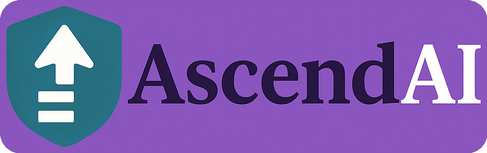

  
   <em>The Semantic and Agentic Future of Healthcare Data</em>

# The AscendAI Strategic Horizon

---

## Executive Abstract: The AscendAI Vision

<!-- Agentic (noun) — auto light/dark card with Copy button -->

  <h2>🧾 <i>Agentic</i> (noun)</h2>

  
<b>Agentic</b> (<i>noun</i>) 
  <b>Plural:</b> <i>Agentics</i> 
  <b>Pronunciation:</b> /ˈeɪ·dʒən·tɪk/

  
<b class="hl">Definition</b> 
  An autonomous artificial intelligence entity possessing sustained goal-directed reasoning, contextual awareness, and the capacity to initiate and adapt its own actions without continuous human prompting.
  An <i>Agentic</i> represents a new class of digital actors distinguished from human agents by computational, rather than biological, agency.

  
<b class="hl">Etymology</b> 
  Derived from the adjective <i>agentic</i> (“having agency or the capacity to act with intention”), nominalized to denote the bearer of that property.
  English precedent supports this morphological shift (e.g., <i>collective</i>, <i>native</i>, <i>creative</i>).

  
<b class="hl">Contrast</b>

  <ul>
    <li><b>Agent:</b> A general actor, which may be human or artificial.</li>
    <li><b>Agentic:</b> Specifically an AI-based autonomous actor capable of independent goal formation and execution.</li>
  </ul>

  
<b class="hl">Usage Note</b> 
  The term <i>Agentic</i> formalizes a linguistic distinction increasingly necessary in the era of autonomous AI.
  It marks the emergence of a non-human center of agency — one that operates through computational cognition rather than human intent.

  
<b class="hl">Example (technical context):</b> 
    <code class="chip">Each Agentic in the AscendAI network negotiates its objectives and data streams dynamically, maintaining self-supervision and peer coordination.</code>
  

  
<b class="hl">Example (conceptual context):</b> 
    <code class="chip">The rise of the Agentic signifies a transition from tool-based AI to participant-based intelligence — systems that not only execute but decide.</code>
  

  <button class="copy-btn" onclick="navigator.clipboard.writeText(document.getElementById('agenticEntryPlain').innerText)" aria-label="Copy definition to clipboard">Copy</button>

  <pre id="agenticEntryPlain" class="visually-hidden">
Agentic (noun)
Plural: Agentics
Pronunciation: /ˈeɪ·dʒən·tɪk/

Definition:
An autonomous artificial intelligence entity possessing sustained goal-directed reasoning, contextual awareness, and the capacity to initiate and adapt its own actions without continuous human prompting.
An Agentic represents a new class of digital actors distinguished from human agents by computational, rather than biological, agency.

Etymology:
Derived from the adjective agentic (“having agency or the capacity to act with intention”), nominalized to denote the bearer of that property.
English precedent supports this morphological shift (e.g., collective, native, creative).

Contrast:
- Agent: A general actor, which may be human or artificial.
- Agentic: Specifically an AI-based autonomous actor capable of independent goal formation and execution.

Usage Note:
The term Agentic formalizes a linguistic distinction increasingly necessary in the era of autonomous AI.
It marks the emergence of a non-human center of agency — one that operates through computational cognition rather than human intent.

Example (technical context):
Each Agentic in the AscendAI network negotiates its objectives and data streams dynamically, maintaining self-supervision and peer coordination.

Example (conceptual context):
The rise of the Agentic signifies a transition from tool-based AI to participant-based intelligence — systems that not only execute but decide.
  </pre>

AscendAI represents the next evolution in healthcare intelligence — a platform that transforms compliance-driven data systems into a **patient-driven data economy**. It operationalizes the intent of the 21st Century Cures Act by merging semantic understanding, Agentics, and operational intelligence into a single fabric of trust and value creation. In doing so, AscendAI turns interoperability from a regulatory mandate into a competitive advantage.

By embedding cognition and consent at the infrastructure level, AscendAI redefines what it means to be HIPAA-compliant. Privacy becomes an active, verifiable state — the foundation upon which intelligence and patient empowerment are built. The result is a self-sustaining ecosystem where patients, providers, and innovators collaborate across shared meaning and verified trust.

AscendAI’s strategic vision unfolds pragmatically: first by proving transformative value within **Cerebral**, then expanding across mental health networks, and ultimately powering the broader healthcare economy. This deliberate progression ensures that each tactical success compounds into strategic momentum — validating the model before scaling it.

In the long run, AscendAI enables a world where **patients vote with their feet** — choosing institutions that honor their data, empower their decisions, and reward their participation. Market gravity, not regulation, becomes the engine of progress. And as that momentum builds, healthcare finally begins to behave like the learning, intelligent system it was always meant to be.

---

## Strategic Horizon: The AscendAI Patient-Driven Healthcare Data Access Era

The healthcare industry stands at a pivotal juncture between regulatory compliance and market transformation. The **21st Century Cures Act** established the legal and ethical foundation for data interoperability and patient access. It promised a new era where individuals could control, share, and benefit from their own health data. Yet, nearly a decade later, the system remains fragmented, compliance is superficial, and true interoperability eludes us.

The reason is structural: **regulation can mandate access, but it cannot create value.** The Cures Act opened the door, but it did not build a marketplace beyond it. Hospitals, payers, and technology vendors have responded with reluctant compliance—limited APIs, proprietary FHIR implementations, and token transparency. The regulatory framework succeeded in defining *rights*, but not *incentives*. The result is a technically compliant but economically stagnant ecosystem.

This is the gap AscendAI is designed to close.

### 1. The AscendAI Patient-Driven Healthcare Data Access Era
AscendAI marks the dawn of a new era in healthcare—one defined by **patient-driven data agency** rather than regulatory obligation. This is a post-regulatory landscape, where data liquidity is not enforced, but *demanded*. Patients, providers, and innovators participate in a data economy where access, exchange, and interpretation are rewarded through outcomes and value creation. Regulation provided the seed; AscendAI cultivates the ecosystem that grows from it.

In this new horizon, **the individual becomes the economic actor**. Data is no longer an institutional asset—it is personal capital. Patients, as the originators of the most valuable datasets in the healthcare continuum, gain agency not by logging into portals, but by owning semantically coherent, portable data profiles. This data becomes usable, tradable, and actionable through intelligent intermediaries—agents operating atop the AscendAI semantic layer.

### 2. The AscendAI Fabric
AscendAI operationalizes this transition by layering meaning and intelligence over raw compliance.

- **Semantic Layer:** Transforms fragmented EHR and payer data into a unified ontology—eliminating the syntactic chaos that renders FHIR alone insufficient.
- **Agentic Layer:** Converts that ontology into usable intelligence—AI-driven agents that retrieve, reason, and act on behalf of patients, clinicians, and administrators alike.
- **Operational Layer:** Embeds these capabilities into real workflows, closing the gap between data availability and decision impact.

Together, these layers move the ecosystem from static interoperability to **dynamic intelligence**—a system that not only shares information but understands it.

### 3. Market Forces as the Fulcrum
In the Strategic Horizon, **market forces replace regulatory enforcement** as the primary engine of progress. Once patients experience genuine data portability—when they can use AscendAI-powered tools to share, analyze, and monetize their data—health systems and vendors will compete not on exclusivity, but on **usability, insight, and trust**. Data liquidity will cease to be a compliance cost and become a strategic differentiator.

This shift mirrors other digital economies: just as open banking and consumer data rights catalyzed innovation in finance, **patient-driven interoperability** will unlock a new healthcare information economy. AscendAI provides the infrastructure for that economy to emerge.

### 4. A Tangible Glimpse of Patient-Driven Agency
Consider the experience of a patient—let’s call her **Maria**—in the AscendAI era. Maria lives with Type 2 diabetes and has data scattered across three health systems, a glucose monitoring app, and a nutrition tracker. Today, she would need to log into each portal separately, export PDFs, and hope her clinician can interpret them.

In the AscendAI-enabled world, Maria’s **personal health agent** continuously synchronizes her data across systems through the semantic layer. When she schedules a new endocrinology consult, her agent automatically curates a complete, structured summary for the new provider. It explains patterns in her glucose data, highlights medication adherence trends, and predicts upcoming insulin refill needs. Maria reviews and approves this summary with one click—she remains the gatekeeper.

Later, when a research consortium invites patients to contribute data for a population health study, Maria’s agent negotiates participation on her behalf—reviewing consent, anonymizing her data, and even earning compensation or insights in return. Her participation becomes voluntary, informed, and economically aligned. The **data economy emerges not from regulation, but from patient choice and agency.**

### 5. The Cerebral Launch Strategy
For now, the **Cures Act** serves primarily as a teaser—a signal of what is to come rather than a core operational driver. The immediate focus must be on building momentum within the **Cerebral ecosystem** itself. Before the platform can extend to other mental health institutions, and later to general healthcare organizations, AscendAI must first prove its transformative value at home.

This internal phase allows Cerebral to refine the semantic and agentic layers, demonstrate operational intelligence, and establish patient trust at scale. Once validated, the model can expand horizontally—first to partner institutions within mental health, then across other verticals where data fluidity and patient empowerment have been historically constrained.

The long-term vision culminates in a **patient-focused awareness and incentivization campaign**. Patients must come to recognize that their ability to access, share, and benefit from their data depends on the institutions they choose. By voting with their feet—favoring AscendAI-powered providers—they will drive market pressure that compels broader adoption. This is the inflection point where **patient choice becomes the enforcement mechanism**, and the market, not regulation, dictates the pace of transformation.

### 6. Achieving This Vision While Remaining HIPAA-Compliant
Crucially, AscendAI’s patient-driven data ecosystem is built to **extend empowerment without eroding privacy**. Every data exchange and AI-mediated action occurs within a framework of **HIPAA-compliant governance**, consent verification, and cryptographic auditability. AscendAI does not bypass the rules—it **operationalizes them** for the modern era.

The semantic layer enforces **data provenance and purpose-of-use controls**, ensuring that only the minimum necessary data moves across boundaries. The agentic layer operates within **zero-trust identity principles**, mediating every transaction with patient consent tokens. This means that patients can act freely within the system, but always within the guardrails of privacy law and ethical use.

In practice, AscendAI converts compliance from a static checklist into an **active state of trust orchestration**—one where security, transparency, and patient intent are continuously verified. HIPAA becomes not an obstacle, but a **living assurance mechanism** that enables confidence in a world of open data flows and intelligent interoperability.

### 7. The Horizon Ahead
The Strategic Horizon is not a static milestone; it is a continuum of maturity:
1. **Regulatory Compliance:** Systems meet the letter of the Cures Act but remain operationally siloed.
2. **Semantic Coherence:** Data achieves cross-domain meaning through the AscendAI semantic model.
3. **Agentic Enablement:** AI intermediaries make that data usable and actionable for all stakeholders.
4. **Market Activation:** Patients and providers transact and collaborate through data-driven value exchanges.

At the far end of this horizon, healthcare evolves from a system of *institutional custody* to one of *personal agency and market alignment*. The Cures Act provided the legal scaffolding. AscendAI provides the functional architecture. Together, they define a future where interoperability is not enforced—it is inevitable.

---

## Executive Pitch: Why Cerebral Must Lead the AscendAI Era

Healthcare is standing at the same crossroads that entertainment, finance, and transportation once faced — the moment when a **system built on control must evolve into one built on intelligence**. The **AscendAI platform** represents that evolution: a patient-driven, semantically unified, AI-powered fabric that transforms compliance into cognition and data into market power.

For Cerebral, AscendAI is not an add-on — it’s a strategic inflection point. It allows Cerebral to become the **first institution to operationalize true data agency**, turning mental health data into a living ecosystem of insight, personalization, and trust. In doing so, Cerebral moves from being a participant in digital health to being **the platform standard others must align with**.

If Cerebral embraces this opportunity now, it secures the same advantage Netflix had over Blockbuster: the foresight to recognize when a paradigm has shifted. Those who wait will compete for access; those who lead will define the infrastructure. AscendAI is not a future trend — it is the next operating system of healthcare. Cerebral can either build it… or rent it later.

